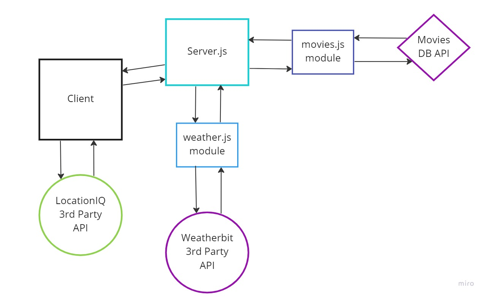

# city-explorer-api

# Project Name

**Author**: Marco Villafana
**Version**: 1.0.0 (increment the patch/fix version number if you make more commits past your first submission)

## Overview
<!-- Provide a high level overview of what this application is and why you are building it, beyond the fact that it's an assignment for this class. (i.e. What's your problem domain?) -->
+ Application will provide data for the City Explorer front-end application. This means users will get to see not only the map, but also interesting information about the area, provided by a variety of third-party APIs that your server will manage.

## Getting Started
<!-- What are the steps that a user must take in order to build this app on their own machine and get it running? -->

## Architecture
<!-- Provide a detailed description of the application design. What technologies (languages, libraries, etc) you're using, and any other relevant design information. -->
+ React
+ React Bootstrap
+ Node.js
+ npm
+ ubuntu
+ VS Code
+ JavaScipt
+ JSX
+ express
+ dotenv
+ cors
+ weatherbit
+ locationIQ

## Change Log
<!-- Use this area to document the iterative changes made to your application as each feature is successfully implemented. Use time stamps. Here's an example:

01-01-2001 4:59pm - Application now has a fully-functional express server, with a GET route for the location resource. -->

## Credit and Collaborations
<!-- Give credit (and a link) to other people or resources that helped you build this application. -->
+ [weather icons](https://github.com/Makin-Things/weather-icons)

## Lab 07

Name of feature: 3
Estimate of time needed to complete: 3 hr

Start time: 2:00 PM

Finish time: 10:00

Actual time needed to complete: 8 hr

## Lab 08

Name of feature: 3
Estimate of time needed to complete: 3 hr

Start time: 1:30 PM

Finish time: 7:30 PM

Actual time needed to complete: 6 hr

## Lab 09

Name of feature: 2
Estimate of time needed to complete: 3 hr

Start time: 2:00 PM

Finish time: 6:10 PM

Actual time needed to complete: 4 hr

## Lab 10

Name of feature: 1
Estimate of time needed to complete: 2 hr

Start time: 1:30 PM

Finish time: 3:30 PM

Actual time needed to complete: 2 hr

